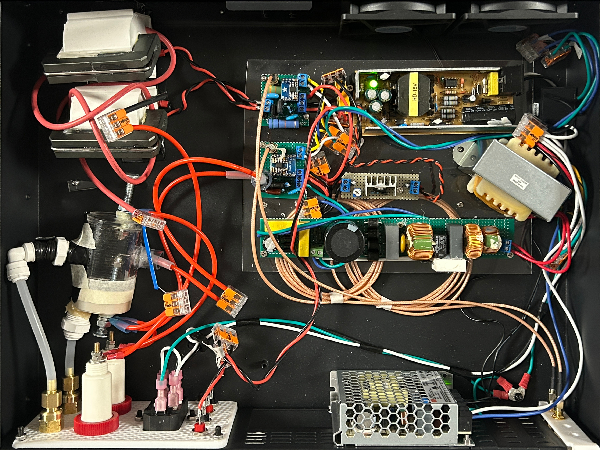
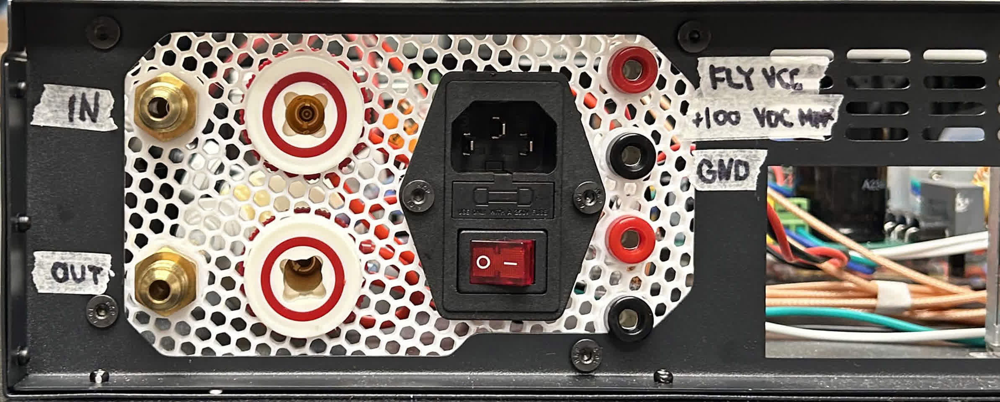
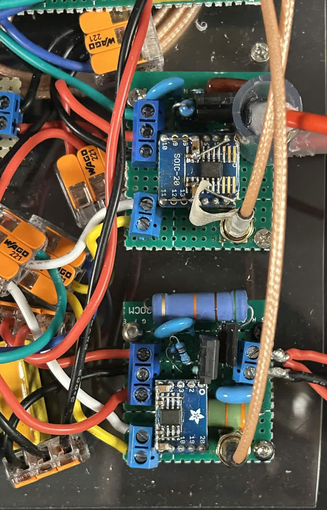
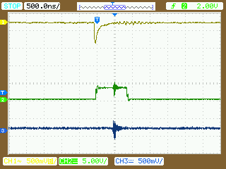
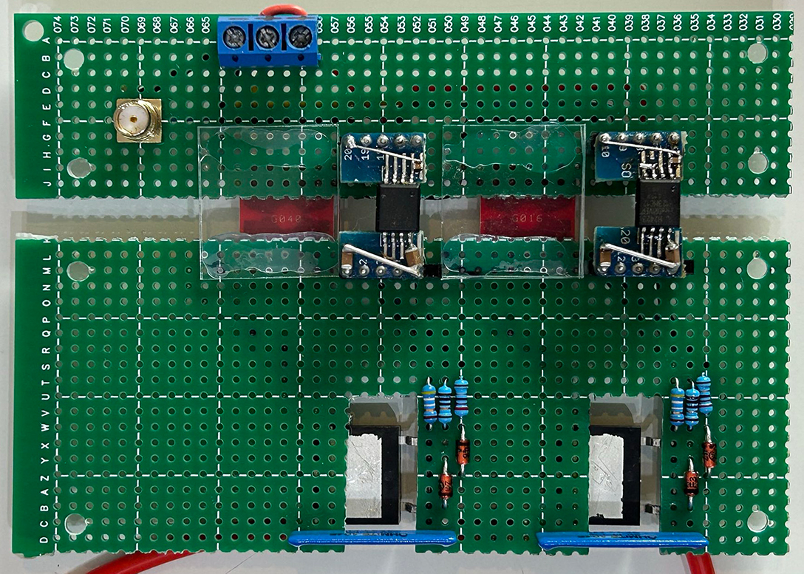
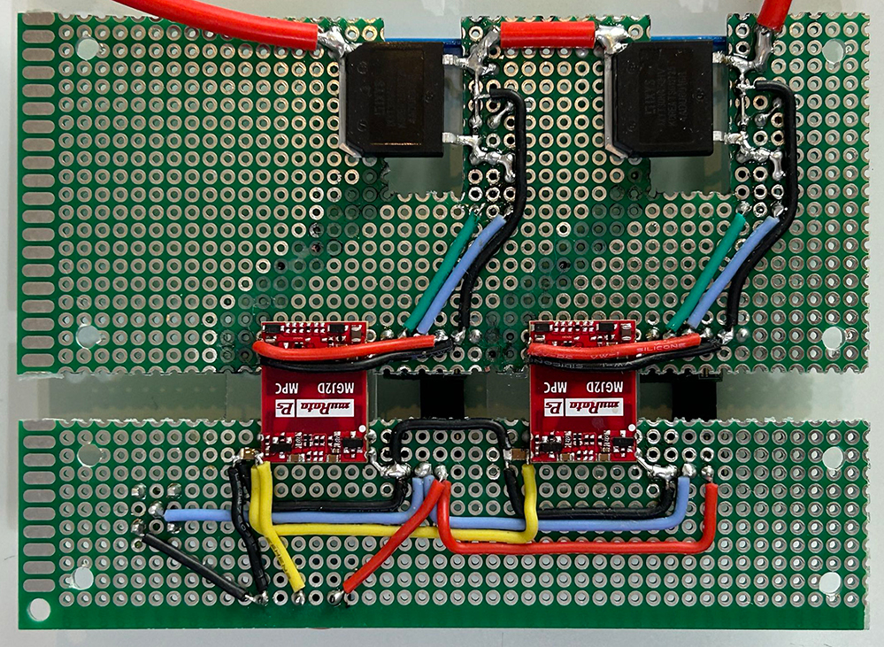
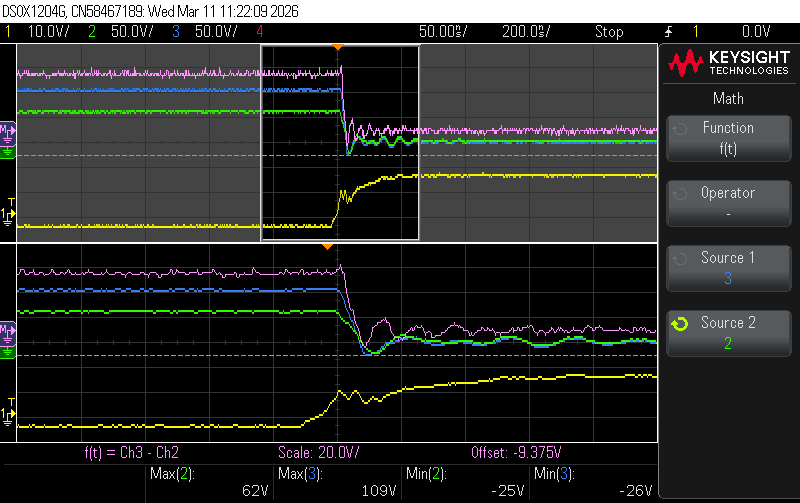
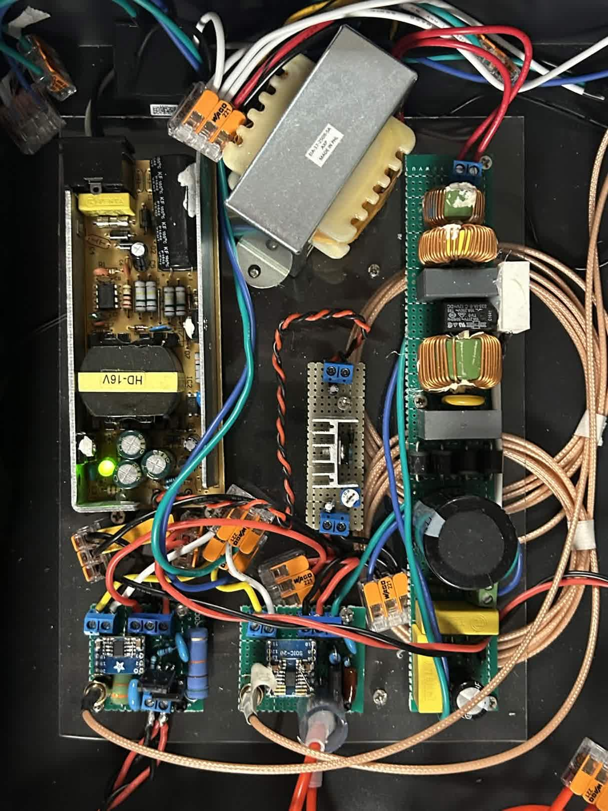

# Hardware

## Documents

- Testing data, scope traces: [Google Drive](https://drive.google.com/drive/folders/1ovZGCYEkT0nIhA84AkriR0ql1ARs0fPW).
- STU Schematic: [PDF](./spark_chamber_schematic.pdf).

## Source Trigger Unit (STU)

The Source Trigger Unit scales an adjustable DC input into a high-voltage DC output, and provides trigger by means of discharging its output to ground. The following is a detailed explanation of the [schematic](./spark_chamber_schematic.pdf).

### Source Trigger Unit (p. 1)

*Top left*: dual-core, series high-voltage flyback transformer. A CO2 laser transformer was chosen due to high power output capabilities, in-built secondary high-voltage flyback diode, and a appropriate primary/secondary winding ratio for high voltage generation. Driving in flyback topology, the output voltage is measured via handheld probe, or measured through an auxiliary winding (not shown) to be calculated through voltage relation with turns ratio. 

*Bottom left*: power input/output and triggered spark gap with gas lines. High-voltage, double-insulated silicone cable was chosen for isolation (10kV, 18AWG, 6733-2 Pomona Electronics), in bright red. While WAGO 221 Lever-Nuts are not rated for the full voltage swing, proper distancing between connections ensures proper isolatation.

*Top right*: trigger and power electronics. Isolated from grounded chassis via nylon standoffs and drilled PMMA plane. 

*Bottom right*: resonant clock input for high-voltage generation and trigger line. SMA lines are low-voltage, grounded, and isolated from high voltage and high dV/dt nodes.

STU back pannel with inputs. *From left to right.* Brass argon inputs and outputs (1/4" NPT flare fittings) feed through to the spark gap. High voltage 4mm banana jacks serve as high voltage and trigger output. IEC C-14 mains input with fuse, switch, and LED indication. 4mm banana jacks for adjustable input DC bias for HV generation. Two spare 4mm banana jacks for future use.

### Flyback Converter & Spark Gap Trigger (p. 2-3)

SMA coax cable on both circuits are on the low voltage side, isolated from the mosfets via isolated gate drivers. Low voltage (+5V) power is provided via white/yellow cables. Gate drive (+12V) provided from red/black cables. Trigger drive (+170V) in green. Isolated gate drivers are manually soldered on SOIC-8 breakout boards, scored and cut to size.

*Left*: spark gap trigger driver. Potted trigger transformer for voltage isolation in upper left corner, with MOSFET and capacitor charge-discharge circuitry.

*Right*: flyback converter driver. Flyback driving MOSFET with SiC snubber diode, and large snubbing resistor. High primary-side leakage inductances from topology are snubbed by RCD clamp and RC snubber on drain. Large THT resistors and active cooling ensure proper dissipation of dV/dt spikes, protecting MOSFET drain during switching.

Switching traces on [Google Drive](https://drive.google.com/drive/folders/1Qudt-7e3kmLJVLlLCeDpCNPIcMS0nvmw). Triggered spark gap oscilloscope trace.

- *Yellow*: PVT (Eljen EJ-200) scintillation on SiPM (OnSemi 60035) after transimpedance amplification (OPA858).
- *Green*: 3V3 CMOS, 1us duration, active-high coincidence output from the FPGA.
- *Blue*: near E-field interference from spark gap breakdown in argon.

### IGBT Trigger (p. 4)

Spark gap replacement in implementation: series insulated gate bipolar transistor (IGBT) trigger. Isolation channels manually carved in PCB in accordance to safety isolation standards.

High CMTI (>200 kV/us) isolated gate drivers and DC-DC converters were chosen due to large dV/dt swing during swiching of the floating IGBT. A common-mode variation of half of the supply voltage will occur on the floating IGBT as the switch turns on and off.

*Top view*: 8 kV isolated gate drivers (1ED3123MC12H), tuned gate drive resistors and static balancing resistors. 40M static balancing high-voltage resistors (long blue strips) act as voltage dividers to share voltage across both IGBTs. This is necesary in steady-state as differences in IGBT leakage may result in uneven sharing of voltage, and thus premature degradation of one of the two IGBTs. Dynamic voltage sharing is achieved by turn-on synchronization through gate-drivers, and turn on resistors. Turn off is explicitly slower than turn on due to dynamic sharing transition to static--time is needed for leakage capacitances to charge back up through the 40M static balancing resistors. A lower turn on gives a larger margin in terms of the RC time constant of the 40M and the parasitics.

*Bottom view*: isolated gate drive power supplies with 4.5 kV IGBTs in series. The bipolar drives (+15V/-5V) supplied by the Murata DC-DC converters (red) diminish risk of Miller turn on, especially in high dV/dt applications (like spark-chambers... duh). Low-voltage side signal line (blue) is directly connected from SMA coax to both gate drivers to ensure simultaneous turn-on, and similar propagation delays.

| *Top*  | *Bottom* |
| --- | --- |
|  |  |

Switching traces on [Google Drive](https://drive.google.com/drive/folders/1RH5A-3IXwoJtOxlYfStJsJdKZLIr2bg-). Such is an example of series IGBT turn on, from static-state voltage sharing, to dynamic, and steady conduction.

- *Yellow*: low-side IGBT gate turn-on with 22R series resistor.
- *Green*: low-side IGBT collector. Low-side $V_{CE}$.
- *Blue*: high-side IGBT collector.
- *Pink*: High-side $V_{CE}$. Difference of blue and green.

### Spark Chamber (p. 5)

When the STU's generated positive voltage is applied on `SW_SPARK`, buffer capacitors charge through 10k resistors to ground. 10k resistors see the full voltage swing until the voltage across them decreases as the capacitors charge.

When `SW_SPARK` is grounded, either by the IGBTs or by the spark gaps, the full voltage is applied across the 10k resistors, on which plates are attached to either end of each resistor. As such, the full voltage swing is applied on the plates, creating sparks aligned with ionization tracks.

### Power Supplies (p. 6)

Different isolated AC-DC integrated power supply modules generate necessary voltage rails. Line isolation is critical for safety and noise immunity. Digital signal stability is also ensured through the grounded-shield coax SMAs for clock and trigger.

*Bottom*: The mains rectifier generates a high voltage (+170V) DC rail for the trigger exciter coil. A line transformer isolates the rectifier's output. Common-mode chokes and inductors filter out noise from triggers which propagate back into the AC lines--ensuring EMI compliance. A soft-starter protects the rectification diodes from inrush current.

