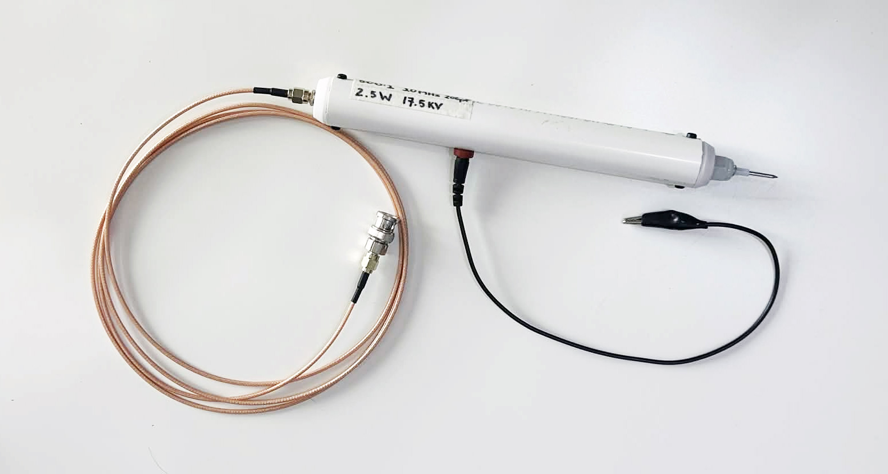
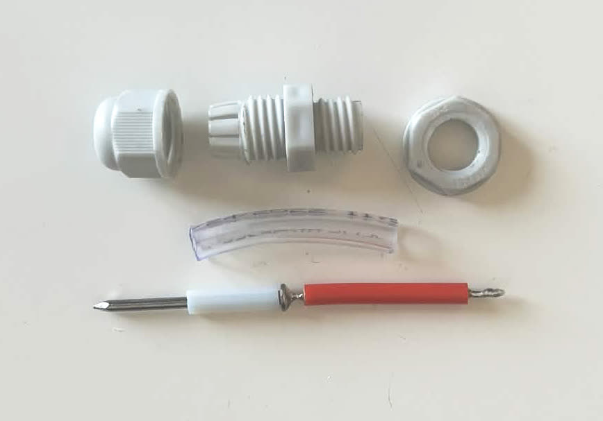
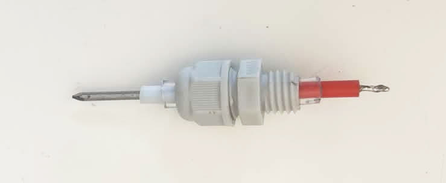
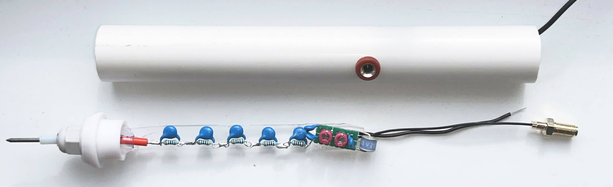
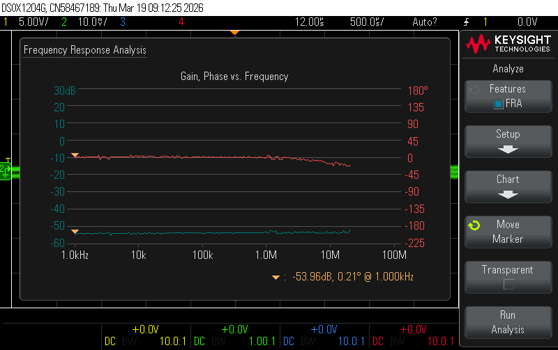
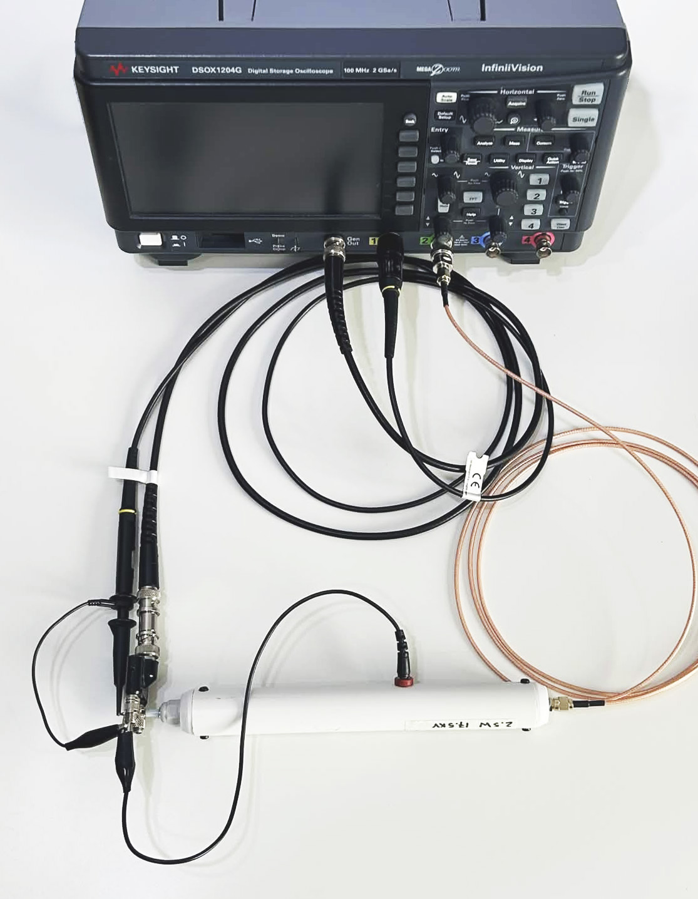

# High Voltage Probe

Compensated 500:1 high voltage probe with 10 MHz bandwidth, adjustable frequency response, and 17.5 kV measurement capability. This probe is meant to recreate the capabilities of a [Tektronix P6015A](https://www.tek.com/en/products/oscilloscopes/oscilloscope-probes/high-voltage-probe-single-ended) while being safe, and reasonably priced.

## Documents

- Testing data, scope traces: [Google Drive](https://drive.google.com/drive/folders/1fRV_-lUVtBa012b_aV9xOPN5UBUo3qJT).
- Probe Schematic: [PDF](../high_voltage_probe.pdf).
- KiCad Project: `./high_voltage_probe.kicad_pro`

## Probe

A PTFE sheating of 1.75 mm (ID) is fitted onto a tinned-nail, with a bonding wire soldered onto its end. A vinyl tube isolates the conductors and increases its diameter to be fit within a standard PTFE 6mm cable gland. PTFE is chosen for its electrical insulation properties, as well as stability.

Tightening the cable gland cap compresses all layers until friction affixes the probe tip position with respect to the gland. Observing the P6015A, we see that the measurement tip needs to be distanced from other objects other that the one measured due to parasitics. A large enough probe tip ensures mechanical separation, as well as isolation.

Hand-soldered attenuation resistors with capacitors are attached onto an acrylic backing for support. A small compensation PCB rests as the end with trimmers adjusted and calibrated. A white PVC tube (3/4") serves as the probe handle. A 4mm banana jack is press-fitted into a drilled hole for the attachment of the grounding lead. The electrical assembly slides into one end of the tube, while 3D-printed end caps are secured by screws to complete the probe.

## Compensation

A resistor divider alone succumbs to parasitic capacitances to ground, diminishing flat frequency response bandwidth as RC low-pass filters are effectively created. A [compensated resistor divider](https://www.analog.com/en/resources/analog-dialogue/studentzone/studentzone-november-2018.html) is thus used for high-frequency response.

### Resistive

A 499M resistor is necessary to match the 1M impedance of the scope. Five 100M (1%) resistors are put in series; the theoretical resistance is within its tolerance, and thus offsets are negligible.

### Capacitive

Five 10pF capacitors are put in series to form a 2pF input capacitance. The probe thus needs to be compensated with 998pF (1000pF). Sum of capacitances:

|Parasitic Source|Capacitance|
|---|---|
|SMA + 1.13mm coax + Construction| ~60 pF|
|Gas Discharge Tube (2027-07-BLF)| 1 pF|
|RG316 Coaxial Cable (2m @ 95 pF/m)| 190 pF|
|Oscilloscope (DSOX1204G)| 16 pF|

|Compensation Source|Capacitance|
|---|---|
|CK45-B3DD471KYNNA| 470 pF|
|2x CK45-B3DD471KYNNA (series)| 235 pF|
|2x Cap. Trimmer (parallel)| 16~40 pF|
 
Total: 988~1012 pF, trimmed and calibrated to 998 pF with SDM3065X.

### Bandwidth Limit & High-frequency Pole Compensation

Beyond 10 MHz, inductive parasitics create a pole and increase in gain. Therefore, a 77.26R resistor may be fitted in series with the output coax considering a downstream capacitance of 206 pF (from RG316 coax. and scope), to yield in a 10 MHz bandwidth. In practice, SMA connector parasitic capacitances increases the 206 pF estimate, and thus 49.9R and 22R are chosen and placed in series.

## Analysis

FRA is conducted on the probe to establish its frequency response from 1 kHz to 20MHz FRA at 50 points/decade. A 500:1 probe yields in a $20 \log{\frac{1}{500}} = -53.98$ $\mathrm{dB}$ attenuation, as per the gain v. frequency of the FRA, which is flat.

*Test setup*: Coaxial BNC to screw terminal cable connects signal output to tip of probe. Input measurement on a 10:1 probe (N2140A). Output measurement directly through high voltage probe coax. External grounding clips all connected to source ground to simulate measurement capacitive parasitics.

