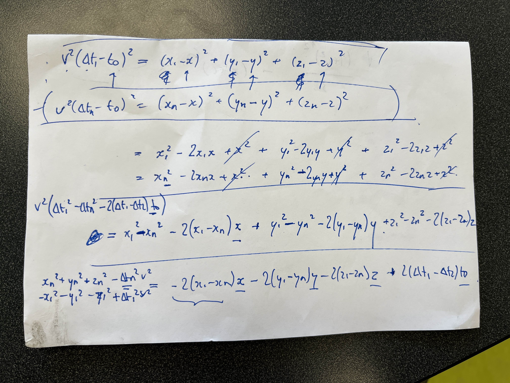

# Sound Triangulation

derivation of the equation used for sound triangulation is below:

four of these linear equations are used to solve for the four unknowns of x, y, z, and time for a single spark

...

